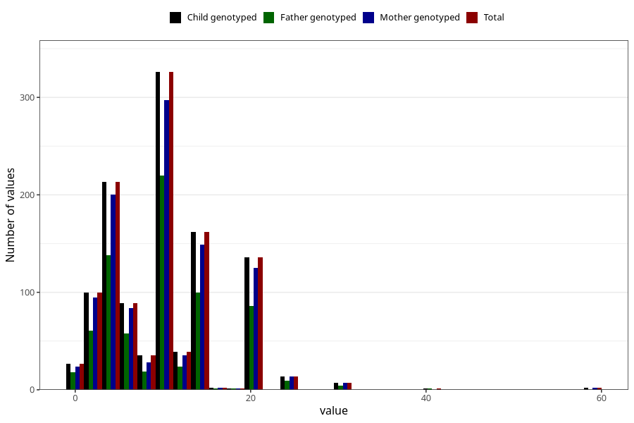

# mother_smoking_before_pregnancy_cigarettes_per_day
Variable mapping to `ROYK_FOER_ANT` in `MFR_541_v12`.
- Number of values:

| Value | Total | Child genotyped | Mother genotyped | Father genotyped |
| ----- | ----- | --------------- | ---------------- | ---------------- |
| Missing | 79851 | 79851 | 75554 | 52864 |
| Non-missing | 1154 | 1154 | 1063 | 740 |
| 25th percentile | 5 | 5 | 5 | 5 |
| 50th percentile | 10 | 10 | 10 | 10 |
| 75th percentile | 15 | 15 | 15 | 15 |
| Mean | 10.2487001733102 | 10.2487001733102 | 10.2220131702728 | 10.1391891891892 |
| Standard deviation | 6.21008489663943 | 6.21008489663943 | 6.22730190173435 | 5.83079681460882 |
| N | 1154 | 1154 | 1063 | 740 |

