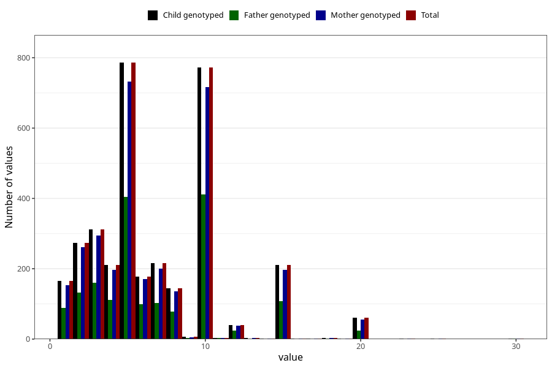

# mother_smoking_end_cigarettes_per_day
Variable mapping to `ROYK_AVSL_ANT` in `MFR_541_v12`.
- Number of values:

| Value | Total | Child genotyped | Mother genotyped | Father genotyped |
| ----- | ----- | --------------- | ---------------- | ---------------- |
| Missing | 77608 | 77608 | 73442 | 51847 |
| Non-missing | 3397 | 3397 | 3175 | 1757 |
| 25th percentile | 4 | 4 | 4 | 4 |
| 50th percentile | 5 | 5 | 5 | 5 |
| 75th percentile | 10 | 10 | 10 | 10 |
| Mean | 6.81336473358846 | 6.81336473358846 | 6.79338582677165 | 6.77859988616961 |
| Standard deviation | 4.12445068052774 | 4.12445068052774 | 4.10719860397752 | 3.99991994194656 |
| N | 3397 | 3397 | 3175 | 1757 |

