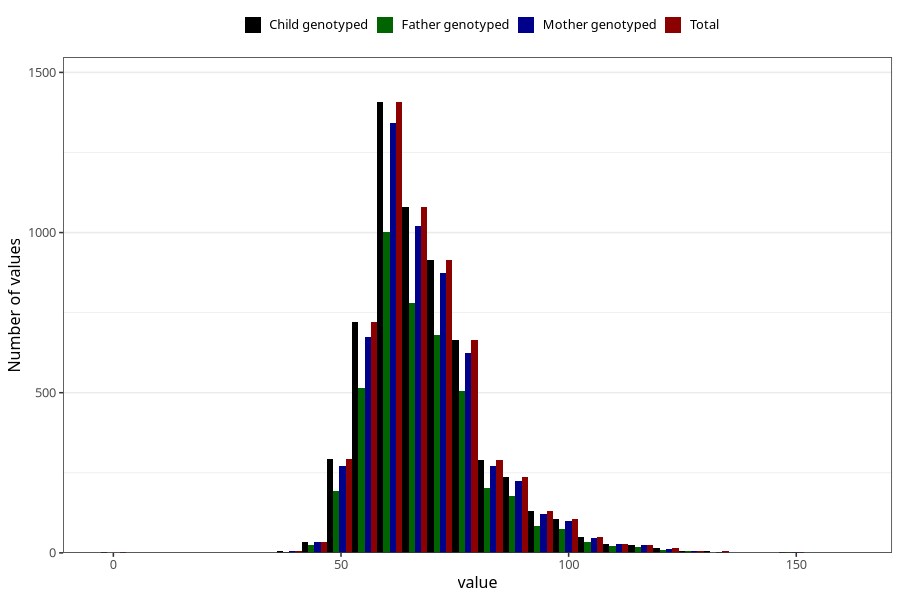

# mother_weight_before
Variable mapping to `MORS_VEKT_FOER` in `MFR_541_v12`.
- Number of values:

| Value | Total | Child genotyped | Mother genotyped | Father genotyped |
| ----- | ----- | --------------- | ---------------- | ---------------- |
| Missing | 74982 | 74982 | 70925 | 49260 |
| Non-missing | 6023 | 6023 | 5692 | 4344 |
| 25th percentile | 60 | 60 | 60 | 60 |
| 50th percentile | 66 | 66 | 66 | 66 |
| 75th percentile | 75 | 75 | 75 | 75 |
| Mean | 68.5402623277436 | 68.5402623277436 | 68.5096626844694 | 68.6500920810313 |
| Standard deviation | 13.3211113289562 | 13.3211113289562 | 13.232378757258 | 13.1542517958747 |
| N | 6023 | 6023 | 5692 | 4344 |

