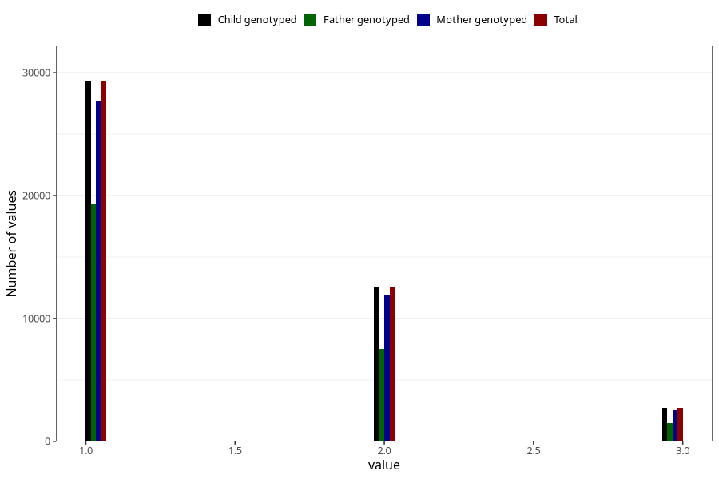

# n_previous_deliveries
Variable mapping to `PARITET_5` in `MFR_541_v12`.
- Number of values:

| Value | Total | Child genotyped | Mother genotyped | Father genotyped |
| ----- | ----- | --------------- | ---------------- | ---------------- |
| Missing | 66 | 66 | 61 | 44 |
| Non-missing | 80939 | 80939 | 76556 | 53560 |
| 0 (primiparous) | 35579 | 35579 | 33563 |24778 |
| 4 or more | 824 | 824 | 772 |408 |
| 1 | 29278 | 29278 | 27733 | 19339 |
| 2 | 12546 | 12546 | 11920 | 7539 |
| 3 | 2712 | 2712 | 2568 | 1496 |

