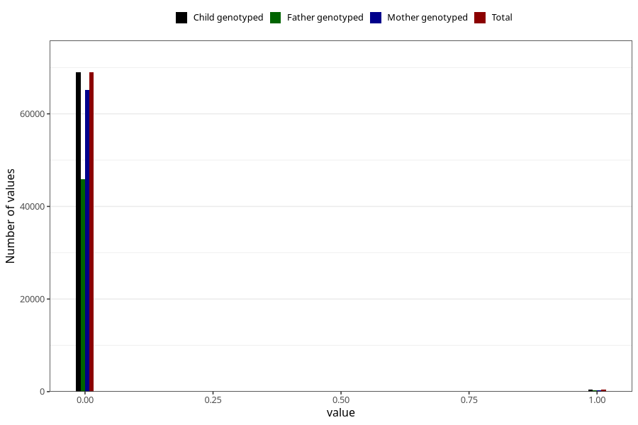

# n_previous_stillbirths
Variable mapping to `DODFODTE_3` in `MFR_541_v12`.
- Number of values:

| Value | Total | Child genotyped | Mother genotyped | Father genotyped |
| ----- | ----- | --------------- | ---------------- | ---------------- |
| Missing | 11654 | 11654 | 11111 | 7479 |
| Non-missing | 69351 | 69351 | 65506 | 46125 |
| 2 or more | 23 | 23 | 22 |11 |
| 0 | 68951 | 68951 | 65130 | 45902 |
| 1 | 377 | 377 | 354 | 212 |

