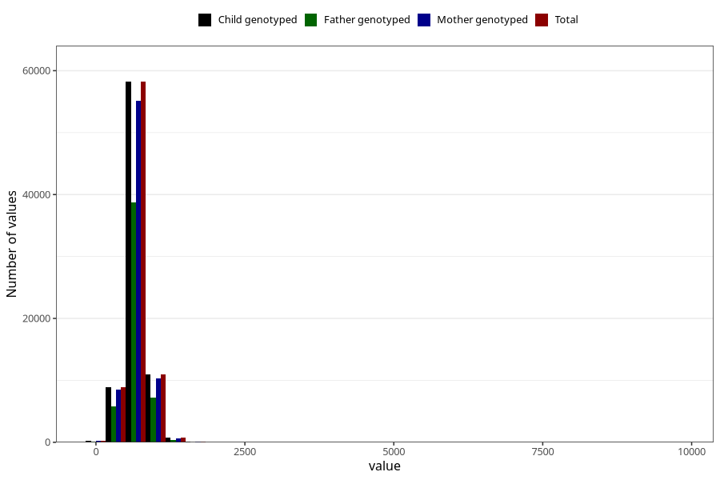

# placental_weight
Variable mapping to `PLACENTAVEKT` in `MFR_541_v12`.
- Number of values:

| Value | Total | Child genotyped | Mother genotyped | Father genotyped |
| ----- | ----- | --------------- | ---------------- | ---------------- |
| Missing | 1833 | 1833 | 1710 | 1181 |
| Non-missing | 79172 | 79172 | 74907 | 52423 |
| 25th percentile | 582 | 582 | 580 | 582 |
| 50th percentile | 670 | 670 | 670 | 670 |
| 75th percentile | 773 | 773 | 771 | 770 |
| Mean | 688.030440054565 | 688.030440054565 | 687.93259641956 | 687.191805123705 |
| Standard deviation | 202.042774306453 | 202.042774306453 | 203.282783148081 | 196.466516501814 |
| N | 79172 | 79172 | 74907 | 52423 |

