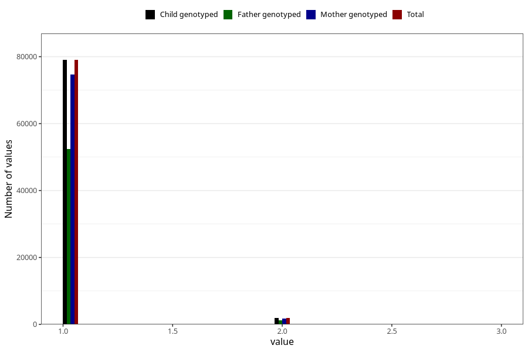

# plurality
Variable mapping to `PLURAL` in `MFR_541_v12`.
- Number of values:

| Value | Total | Child genotyped | Mother genotyped | Father genotyped |
| ----- | ----- | --------------- | ---------------- | ---------------- |
| Missing | 66 | 66 | 61 | 44 |
| Non-missing | 80939 | 80939 | 76556 | 53560 |
| 1 | 79018 | 79018 | 74735 | 52353 |
| 2 | 1902 | 1902 | 1802 | 1200 |
| 3 | 19 | 19 | 19 | 7 |

