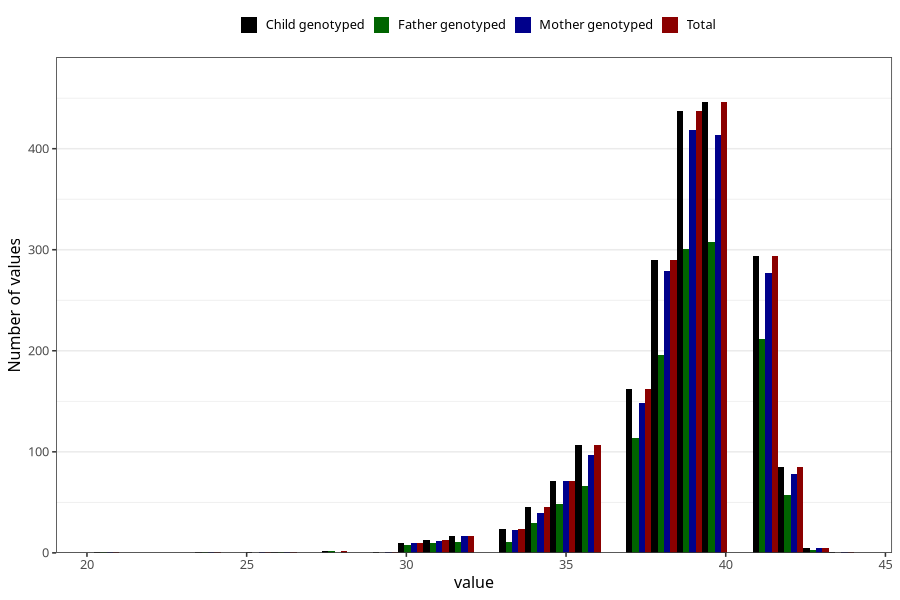

# pregnancy_duration_art_weeks
Variable mapping to `SVLEN_ART` in `MFR_541_v12`.
- Number of values:

| Value | Total | Child genotyped | Mother genotyped | Father genotyped |
| ----- | ----- | --------------- | ---------------- | ---------------- |
| Missing | 78991 | 78991 | 74723 | 52224 |
| Non-missing | 2014 | 2014 | 1894 | 1380 |
| 25th percentile | 38 | 38 | 38 | 38 |
| 50th percentile | 39 | 39 | 39 | 39 |
| 75th percentile | 40 | 40 | 40 | 40 |
| Mean | 38.662859980139 | 38.662859980139 | 38.6668426610348 | 38.7014492753623 |
| Standard deviation | 2.33975575494622 | 2.33975575494622 | 2.32431027084085 | 2.33847242886106 |
| N | 2014 | 2014 | 1894 | 1380 |

