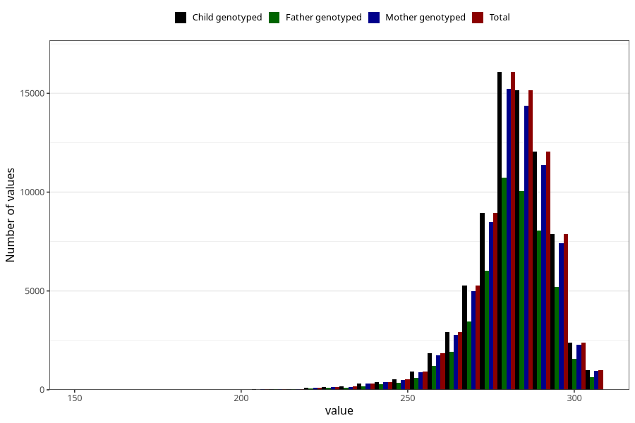

# pregnancy_duration_mens
Variable mapping to `SVLEN_SM_DG` in `MFR_541_v12`.
- Number of values:

| Value | Total | Child genotyped | Mother genotyped | Father genotyped |
| ----- | ----- | --------------- | ---------------- | ---------------- |
| Missing | 4757 | 4757 | 4472 | 3046 |
| Non-missing | 76248 | 76248 | 72145 | 50558 |
| 25th percentile | 275 | 275 | 275 | 275 |
| 50th percentile | 283 | 283 | 283 | 283 |
| 75th percentile | 289 | 289 | 289 | 289 |
| Mean | 281.124160633722 | 281.124160633722 | 281.130209993763 | 281.154930970371 |
| Standard deviation | 12.4561526246981 | 12.4561526246981 | 12.4543949660946 | 12.3620232150727 |
| N | 76248 | 76248 | 72145 | 50558 |

