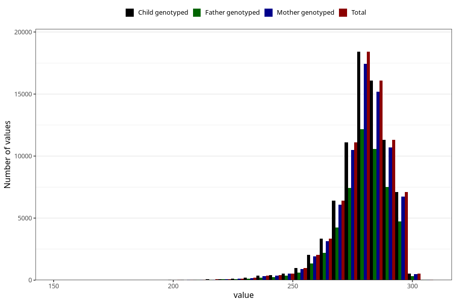

# pregnancy_duration_ultrasound
Variable mapping to `SVLEN_UL_DG` in `MFR_541_v12`.
- Number of values:

| Value | Total | Child genotyped | Mother genotyped | Father genotyped |
| ----- | ----- | --------------- | ---------------- | ---------------- |
| Missing | 1853 | 1853 | 1773 | 1217 |
| Non-missing | 79152 | 79152 | 74844 | 52387 |
| 25th percentile | 274 | 274 | 274 | 274 |
| 50th percentile | 281 | 281 | 281 | 281 |
| 75th percentile | 287 | 287 | 287 | 287 |
| Mean | 279.551521123913 | 279.551521123913 | 279.564721286943 | 279.594536812568 |
| Standard deviation | 11.6842862088854 | 11.6842862088854 | 11.6813450939688 | 11.6787960109479 |
| N | 79152 | 79152 | 74844 | 52387 |

