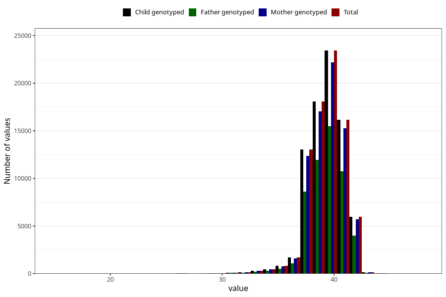

# pregnancy_duration_weeks
Variable mapping to `SVLEN` in `MFR_541_v12`.
- Number of values:

| Value | Total | Child genotyped | Mother genotyped | Father genotyped |
| ----- | ----- | --------------- | ---------------- | ---------------- |
| Missing | 362 | 362 | 348 | 233 |
| Non-missing | 80643 | 80643 | 76269 | 53371 |
| 25th percentile | 39 | 39 | 39 | 39 |
| 50th percentile | 40 | 40 | 40 | 40 |
| 75th percentile | 41 | 41 | 41 | 41 |
| Mean | 39.5129025457882 | 39.5129025457882 | 39.5145996407453 | 39.5196642371325 |
| Standard deviation | 1.71116007698609 | 1.71116007698609 | 1.7117003521063 | 1.71169150529959 |
| N | 80643 | 80643 | 76269 | 53371 |

