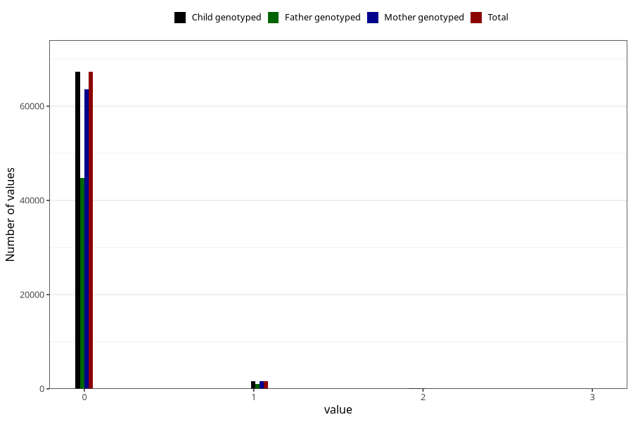

# previous_miscarriages_12_23w
Variable mapping to `SPABORT_23_5` in `MFR_541_v12`.
- Number of values:

| Value | Total | Child genotyped | Mother genotyped | Father genotyped |
| ----- | ----- | --------------- | ---------------- | ---------------- |
| Missing | 11832 | 11832 | 11274 | 7575 |
| Non-missing | 69173 | 69173 | 65343 | 46029 |
| 4 or more | 28 | 28 | 23 |18 |
| 0 | 67279 | 67279 | 63561 | 44808 |
| 1 | 1673 | 1673 | 1579 | 1074 |
| 2 | 158 | 158 | 150 | 104 |
| 3 | 35 | 35 | 30 | 25 |

