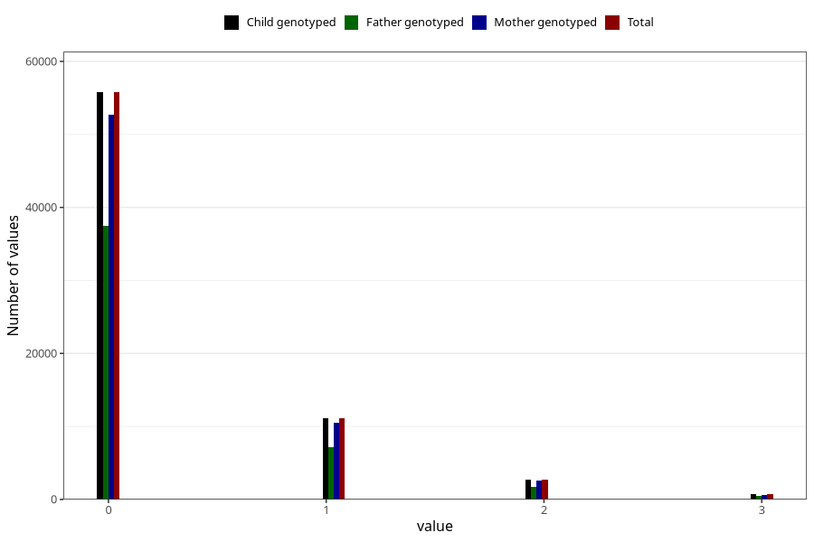

# previous_miscarriages_before_12w
Variable mapping to `SPABORT_12_5` in `MFR_541_v12`.
- Number of values:

| Value | Total | Child genotyped | Mother genotyped | Father genotyped |
| ----- | ----- | --------------- | ---------------- | ---------------- |
| Missing | 10304 | 10304 | 9813 | 6617 |
| Non-missing | 70701 | 70701 | 66804 | 46987 |
| 4 or more | 389 | 389 | 352 |228 |
| 0 | 55767 | 55767 | 52686 | 37433 |
| 1 | 11150 | 11150 | 10556 | 7193 |
| 2 | 2697 | 2697 | 2546 | 1701 |
| 3 | 698 | 698 | 664 | 432 |

