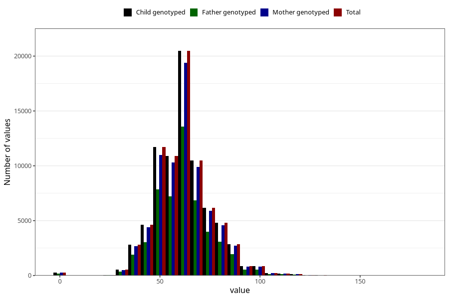

# umbilical_cord_length
Variable mapping to `NAVLESNORLENGDE` in `MFR_541_v12`.
- Number of values:

| Value | Total | Child genotyped | Mother genotyped | Father genotyped |
| ----- | ----- | --------------- | ---------------- | ---------------- |
| Missing | 2974 | 2974 | 2795 | 1998 |
| Non-missing | 78031 | 78031 | 73822 | 51606 |
| 25th percentile | 52 | 52 | 52 | 52 |
| 50th percentile | 60 | 60 | 60 | 60 |
| 75th percentile | 70 | 70 | 70 | 70 |
| Mean | 61.9563353026361 | 61.9563353026361 | 61.9906098453036 | 61.8548870286401 |
| Standard deviation | 14.1116054454716 | 14.1116054454716 | 14.1075162885656 | 14.1176561902602 |
| N | 78031 | 78031 | 73822 | 51606 |

