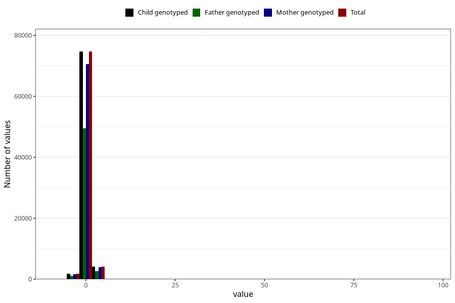

# weight_birth_z_ga
Variable mapping to `ZSCORE_BW_GA` in `MFR_541_v12`.
- Number of values:

| Value | Total | Child genotyped | Mother genotyped | Father genotyped |
| ----- | ----- | --------------- | ---------------- | ---------------- |
| Missing | 388 | 388 | 374 | 249 |
| Non-missing | 80617 | 80617 | 76243 | 53355 |
| 25th percentile | -0.54 | -0.54 | -0.54 | -0.54 |
| 50th percentile | 0.09 | 0.09 | 0.09 | 0.08 |
| 75th percentile | 0.74 | 0.74 | 0.74 | 0.74 |
| Mean | 0.128534428222335 | 0.128534428222335 | 0.128497304670593 | 0.123455908537157 |
| Standard deviation | 1.07685731983933 | 1.07685731983933 | 1.08204737175966 | 1.05900776777438 |
| N | 80617 | 80617 | 76243 | 53355 |

