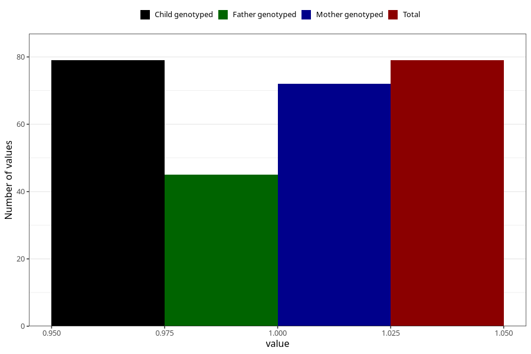

# amphetamine_before
Variable mapping to `AA1438` in `Skjema1_v12`.
- Number of values:

| Value | Total | Child genotyped | Mother genotyped | Father genotyped |
| ----- | ----- | --------------- | ---------------- | ---------------- |
| Missing | 80926 | 80926 | 76545 | 53559 |
| Non-missing | 79 | 79 | 72 | 45 |
| 1 | 79 | 79 | 72 | 45 |

