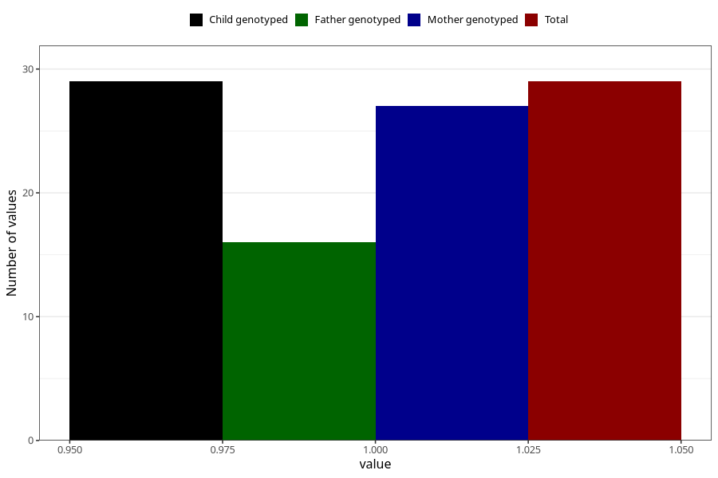

# amphetamine_during
Variable mapping to `AA1439` in `Skjema1_v12`.
- Number of values:

| Value | Total | Child genotyped | Mother genotyped | Father genotyped |
| ----- | ----- | --------------- | ---------------- | ---------------- |
| Missing | 80976 | 80976 | 76590 | 53588 |
| Non-missing | 29 | 29 | 27 | 16 |
| 1 | 29 | 29 | 27 | 16 |

