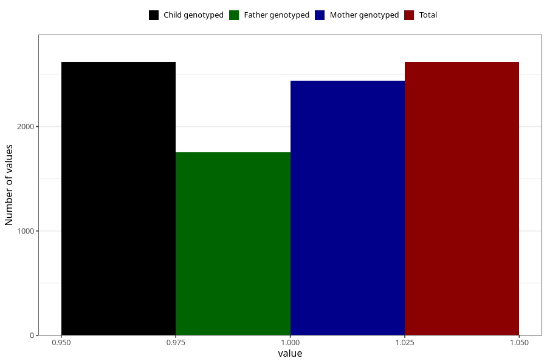

# anxiety_before
Variable mapping to `AA878` in `Skjema1_v12`.
- Number of values:

| Value | Total | Child genotyped | Mother genotyped | Father genotyped |
| ----- | ----- | --------------- | ---------------- | ---------------- |
| Missing | 78387 | 78387 | 74179 | 51852 |
| Non-missing | 2618 | 2618 | 2438 | 1752 |
| 1 | 2618 | 2618 | 2438 | 1752 |

