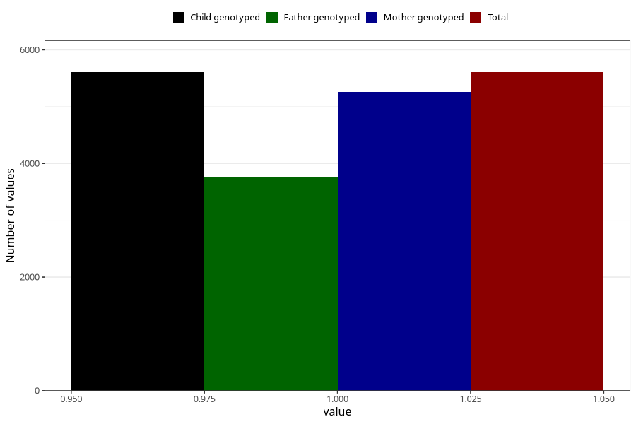

# asthma_before
Variable mapping to `AA419` in `Skjema1_v12`.
- Number of values:

| Value | Total | Child genotyped | Mother genotyped | Father genotyped |
| ----- | ----- | --------------- | ---------------- | ---------------- |
| Missing | 75400 | 75400 | 71354 | 49845 |
| Non-missing | 5605 | 5605 | 5263 | 3759 |
| 1 | 5605 | 5605 | 5263 | 3759 |

