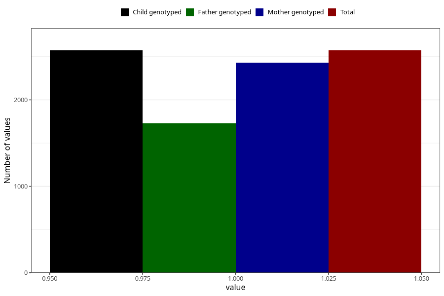

# asthma_during
Variable mapping to `AA420` in `Skjema1_v12`.
- Number of values:

| Value | Total | Child genotyped | Mother genotyped | Father genotyped |
| ----- | ----- | --------------- | ---------------- | ---------------- |
| Missing | 78433 | 78433 | 74184 | 51878 |
| Non-missing | 2572 | 2572 | 2433 | 1726 |
| 1 | 2572 | 2572 | 2433 | 1726 |

