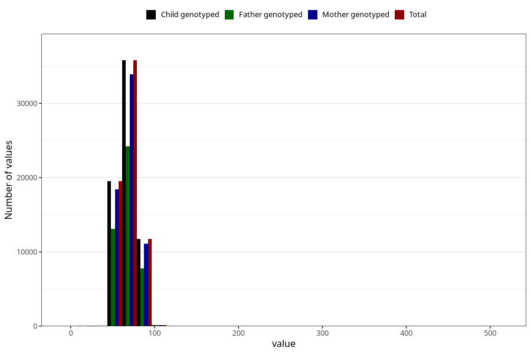

# blood_pressure_15w_diastolic
Variable mapping to `AA84` in `Skjema1_v12`.
- Number of values:

| Value | Total | Child genotyped | Mother genotyped | Father genotyped |
| ----- | ----- | --------------- | ---------------- | ---------------- |
| Missing | 13611 | 13611 | 12790 | 8282 |
| Non-missing | 67394 | 67394 | 63827 | 45322 |
| 25th percentile | 60 | 60 | 60 | 60 |
| 50th percentile | 70 | 70 | 70 | 70 |
| 75th percentile | 75 | 75 | 75 | 75 |
| Mean | 68.6964269816304 | 68.6964269816304 | 68.7056104783242 | 68.688275009929 |
| Standard deviation | 9.38385711937096 | 9.38385711937096 | 9.38548548429696 | 9.43626236168886 |
| N | 67394 | 67394 | 63827 | 45322 |

