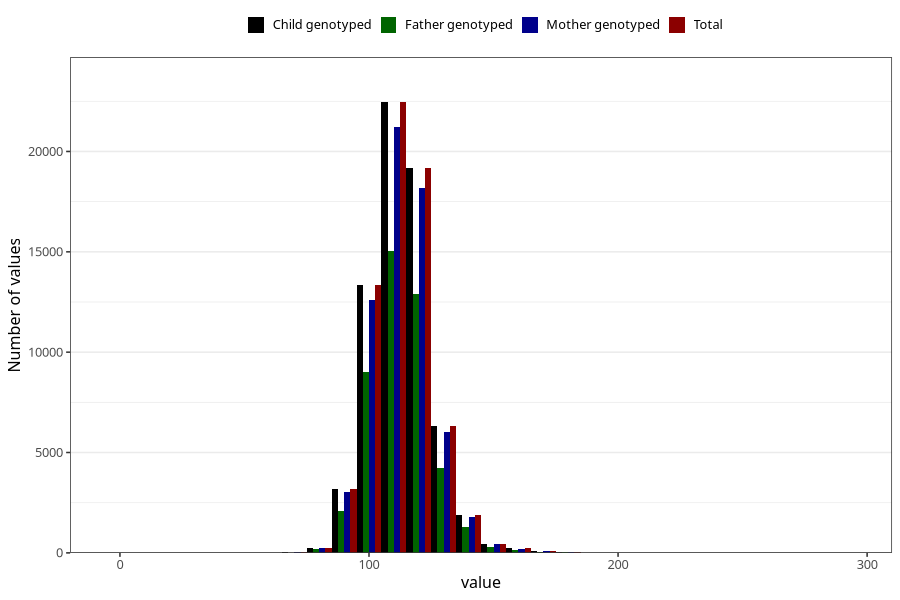

# blood_pressure_15w_systolic
Variable mapping to `AA83` in `Skjema1_v12`.
- Number of values:

| Value | Total | Child genotyped | Mother genotyped | Father genotyped |
| ----- | ----- | --------------- | ---------------- | ---------------- |
| Missing | 13549 | 13549 | 12730 | 8236 |
| Non-missing | 67456 | 67456 | 63887 | 45368 |
| 25th percentile | 105 | 105 | 106 | 106 |
| 50th percentile | 112 | 112 | 112 | 112 |
| 75th percentile | 120 | 120 | 120 | 120 |
| Mean | 114.019583135674 | 114.019583135674 | 114.053657238562 | 114.055832304708 |
| Standard deviation | 12.1770699980018 | 12.1770699980018 | 12.1717689413419 | 12.139242165839 |
| N | 67456 | 67456 | 63887 | 45368 |

