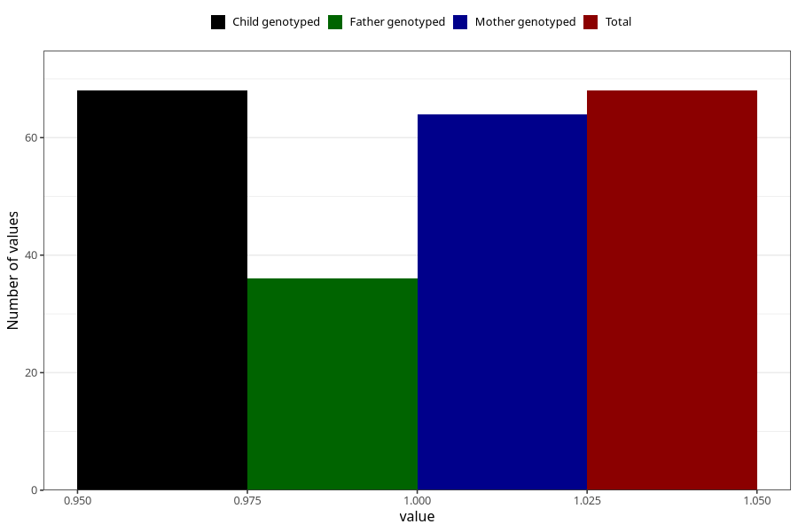

# cocaine_before
Variable mapping to `AA1446` in `Skjema1_v12`.
- Number of values:

| Value | Total | Child genotyped | Mother genotyped | Father genotyped |
| ----- | ----- | --------------- | ---------------- | ---------------- |
| Missing | 80937 | 80937 | 76553 | 53568 |
| Non-missing | 68 | 68 | 64 | 36 |
| 1 | 68 | 68 | 64 | 36 |

