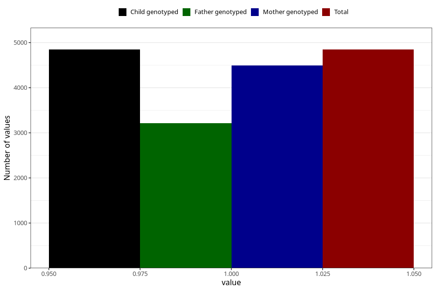

# depression_before
Variable mapping to `AA869` in `Skjema1_v12`.
- Number of values:

| Value | Total | Child genotyped | Mother genotyped | Father genotyped |
| ----- | ----- | --------------- | ---------------- | ---------------- |
| Missing | 76160 | 76160 | 72121 | 50394 |
| Non-missing | 4845 | 4845 | 4496 | 3210 |
| 1 | 4845 | 4845 | 4496 | 3210 |

