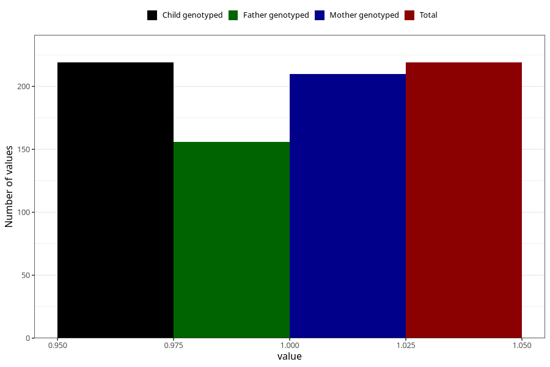

# diabetes_insulin_during
Variable mapping to `AA510` in `Skjema1_v12`.
- Number of values:

| Value | Total | Child genotyped | Mother genotyped | Father genotyped |
| ----- | ----- | --------------- | ---------------- | ---------------- |
| Missing | 80786 | 80786 | 76407 | 53448 |
| Non-missing | 219 | 219 | 210 | 156 |
| 1 | 219 | 219 | 210 | 156 |

