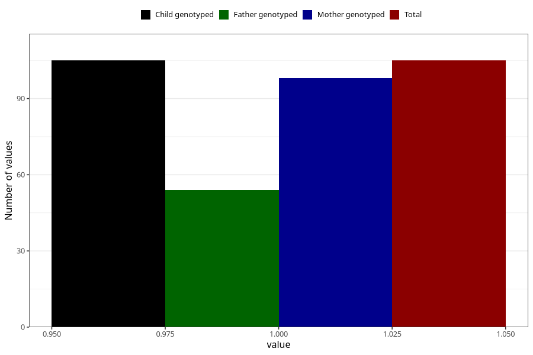

# diabetes_no_insuling_during
Variable mapping to `AA519` in `Skjema1_v12`.
- Number of values:

| Value | Total | Child genotyped | Mother genotyped | Father genotyped |
| ----- | ----- | --------------- | ---------------- | ---------------- |
| Missing | 80900 | 80900 | 76519 | 53550 |
| Non-missing | 105 | 105 | 98 | 54 |
| 1 | 105 | 105 | 98 | 54 |

