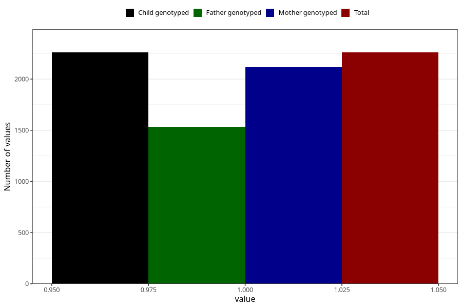

# eating_disorders_before
Variable mapping to `AA806` in `Skjema1_v12`.
- Number of values:

| Value | Total | Child genotyped | Mother genotyped | Father genotyped |
| ----- | ----- | --------------- | ---------------- | ---------------- |
| Missing | 78745 | 78745 | 74502 | 52071 |
| Non-missing | 2260 | 2260 | 2115 | 1533 |
| 1 | 2260 | 2260 | 2115 | 1533 |

