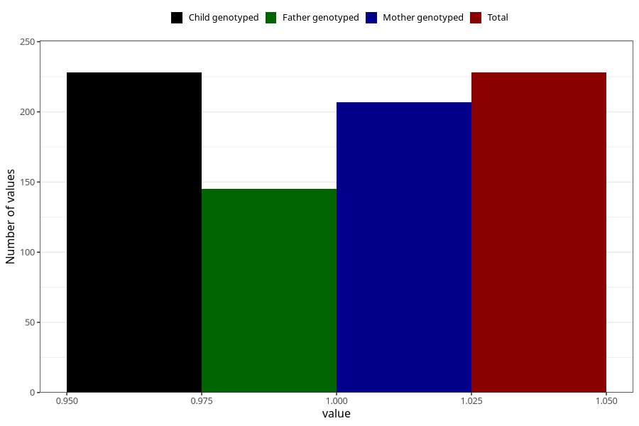

# eating_disorders_during
Variable mapping to `AA807` in `Skjema1_v12`.
- Number of values:

| Value | Total | Child genotyped | Mother genotyped | Father genotyped |
| ----- | ----- | --------------- | ---------------- | ---------------- |
| Missing | 80777 | 80777 | 76410 | 53459 |
| Non-missing | 228 | 228 | 207 | 145 |
| 1 | 228 | 228 | 207 | 145 |

