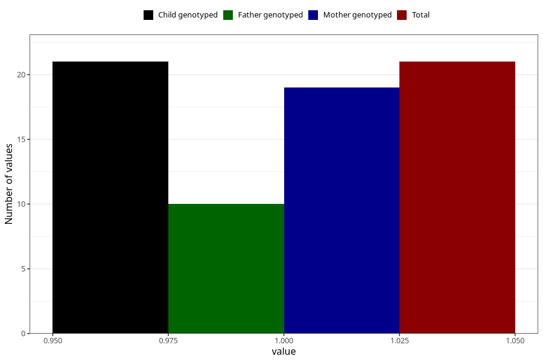

# ecstasy_before
Variable mapping to `AA1442` in `Skjema1_v12`.
- Number of values:

| Value | Total | Child genotyped | Mother genotyped | Father genotyped |
| ----- | ----- | --------------- | ---------------- | ---------------- |
| Missing | 80984 | 80984 | 76598 | 53594 |
| Non-missing | 21 | 21 | 19 | 10 |
| 1 | 21 | 21 | 19 | 10 |

