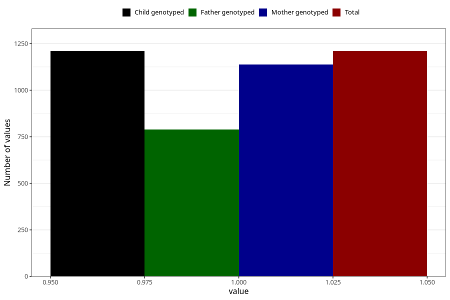

# endometriosis_before
Variable mapping to `AA689` in `Skjema1_v12`.
- Number of values:

| Value | Total | Child genotyped | Mother genotyped | Father genotyped |
| ----- | ----- | --------------- | ---------------- | ---------------- |
| Missing | 79795 | 79795 | 75479 | 52815 |
| Non-missing | 1210 | 1210 | 1138 | 789 |
| 1 | 1210 | 1210 | 1138 | 789 |

