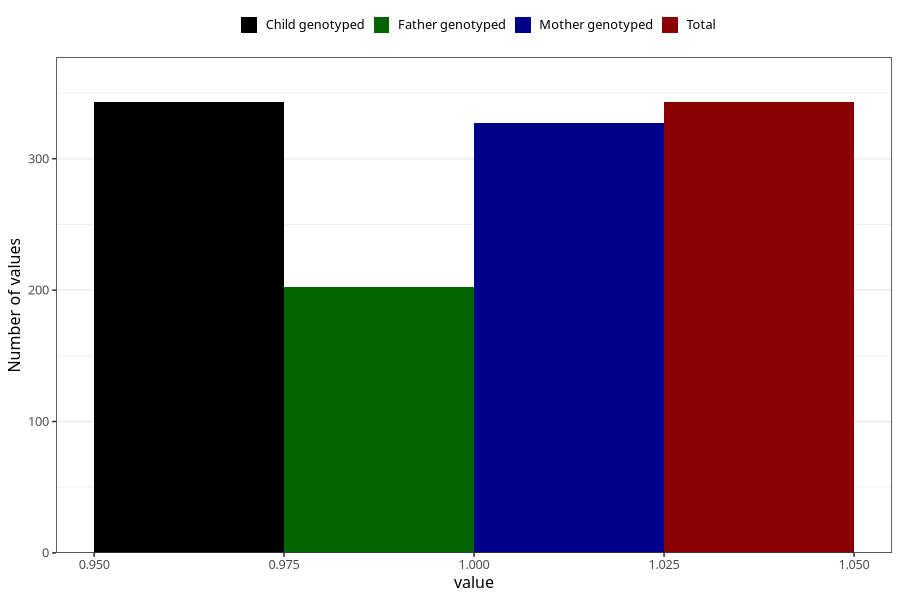

# hash_before
Variable mapping to `AA1434` in `Skjema1_v12`.
- Number of values:

| Value | Total | Child genotyped | Mother genotyped | Father genotyped |
| ----- | ----- | --------------- | ---------------- | ---------------- |
| Missing | 80662 | 80662 | 76290 | 53402 |
| Non-missing | 343 | 343 | 327 | 202 |
| 1 | 343 | 343 | 327 | 202 |

