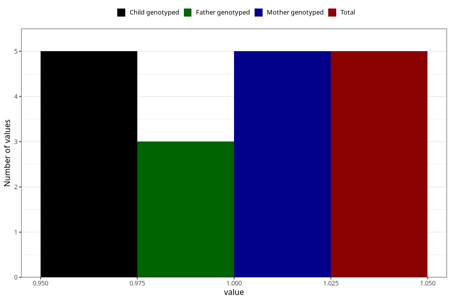

# heroin_before
Variable mapping to `AA1450` in `Skjema1_v12`.
- Number of values:

| Value | Total | Child genotyped | Mother genotyped | Father genotyped |
| ----- | ----- | --------------- | ---------------- | ---------------- |
| Missing | 81000 | 81000 | 76612 | 53601 |
| Non-missing | 5 | 5 | 5 | 3 |
| 1 | 5 | 5 | 5 | 3 |

