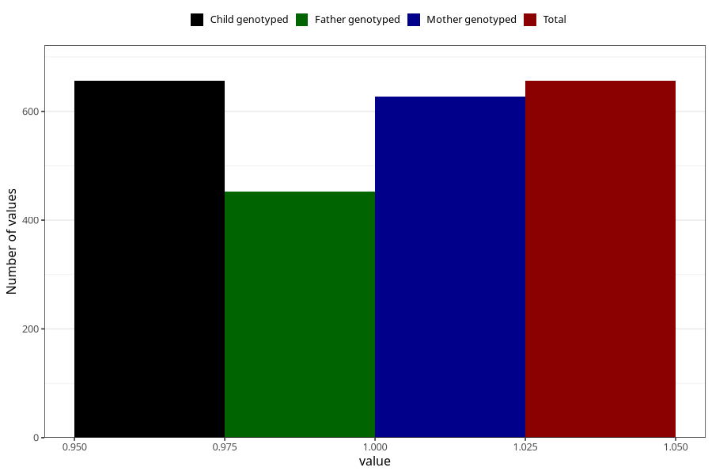

# high_cholesterol_before
Variable mapping to `AA545` in `Skjema1_v12`.
- Number of values:

| Value | Total | Child genotyped | Mother genotyped | Father genotyped |
| ----- | ----- | --------------- | ---------------- | ---------------- |
| Missing | 80349 | 80349 | 75990 | 53152 |
| Non-missing | 656 | 656 | 627 | 452 |
| 1 | 656 | 656 | 627 | 452 |

