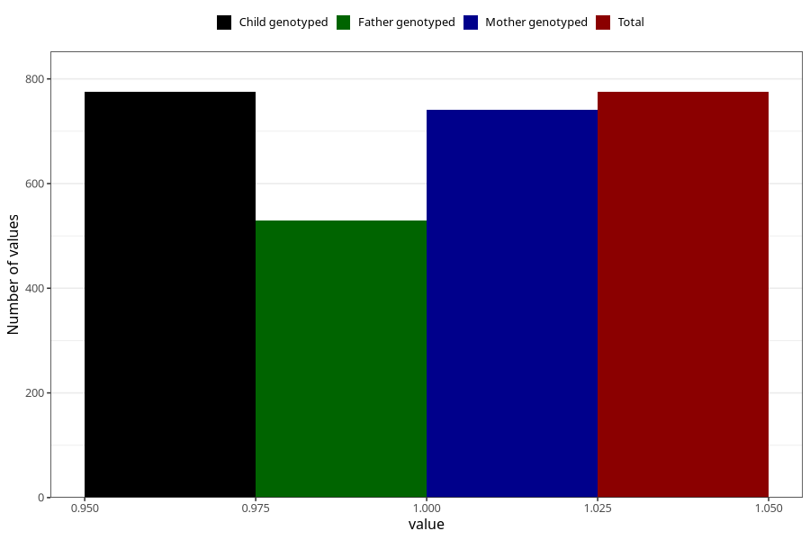

# highest_blood_pressure_before_pregnancy
Variable mapping to `AA554` in `Skjema1_v12`.
- Number of values:

| Value | Total | Child genotyped | Mother genotyped | Father genotyped |
| ----- | ----- | --------------- | ---------------- | ---------------- |
| Missing | 80230 | 80230 | 75876 | 53075 |
| Non-missing | 775 | 775 | 741 | 529 |
| 1 | 775 | 775 | 741 | 529 |

