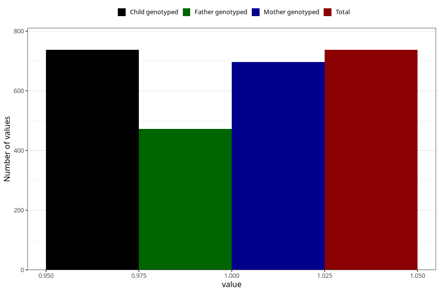

# highest_blood_pressure_during_pregnancy_15w
Variable mapping to `AA555` in `Skjema1_v12`.
- Number of values:

| Value | Total | Child genotyped | Mother genotyped | Father genotyped |
| ----- | ----- | --------------- | ---------------- | ---------------- |
| Missing | 80268 | 80268 | 75920 | 53132 |
| Non-missing | 737 | 737 | 697 | 472 |
| 1 | 737 | 737 | 697 | 472 |

