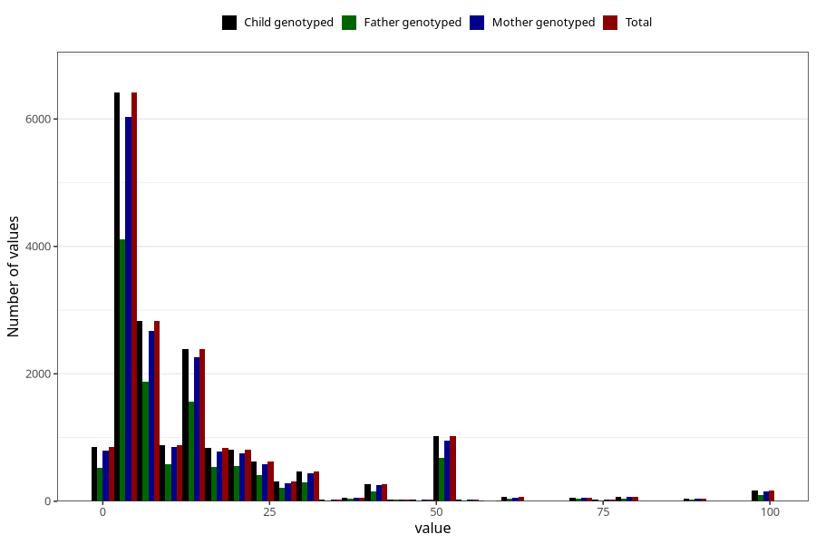

# three_lth_md_duration_before_pregnancy
Variable mapping to `AA1578` in `Skjema1_v12`.
- Number of values:

| Value | Total | Child genotyped | Mother genotyped | Father genotyped |
| ----- | ----- | --------------- | ---------------- | ---------------- |
| Missing | 62702 | 62702 | 59395 | 41690 |
| Non-missing | 18303 | 18303 | 17222 | 11914 |
| 25th percentile | 4 | 4 | 4 | 4 |
| 50th percentile | 8 | 8 | 8 | 8 |
| 75th percentile | 16 | 16 | 16 | 16 |
| Mean | 13.9125826367262 | 13.9125826367262 | 13.8739403089072 | 14.0293772032902 |
| Standard deviation | 16.9771297244382 | 16.9771297244382 | 16.9100396526781 | 16.9927219571016 |
| N | 18303 | 18303 | 17222 | 11914 |

