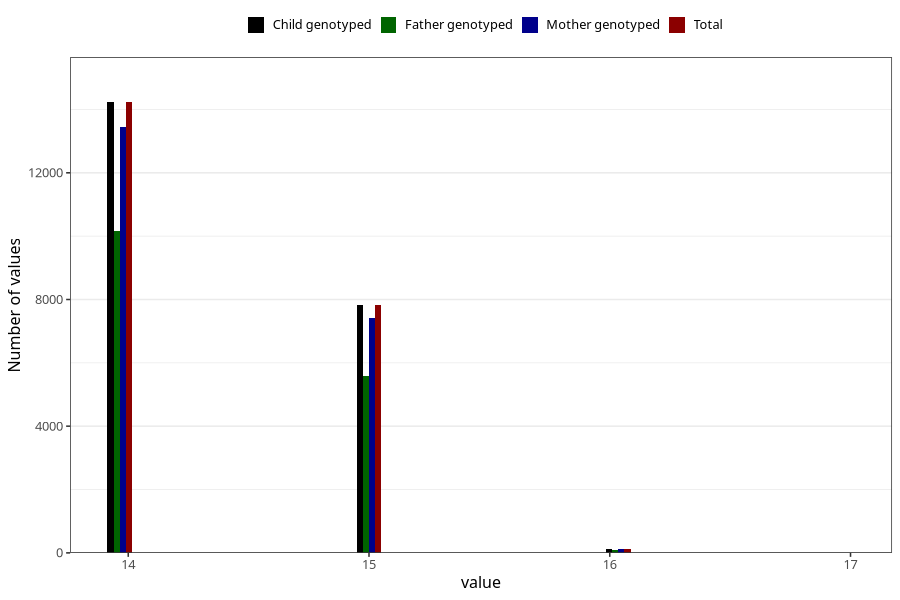

# age_answering_q_14m
Variable mapping to `AGE_YRS_UM` in `Ungdomsskjema_Mor_v12_standard`.
- Number of values:

| Value | Total | Child genotyped | Mother genotyped | Father genotyped |
| ----- | ----- | --------------- | ---------------- | ---------------- |
| Missing | 58815 | 58815 | 55620 | 37782 |
| Non-missing | 22190 | 22190 | 20997 | 15822 |
| 14 | 14229 | 14229 | 13455 | 10155 |
| 15 | 7825 | 7825 | 7412 | 5574 |
| 16 | 134 | 134 | 128 | 91 |
| 17 | 2 | 2 | 2 | 2 |

