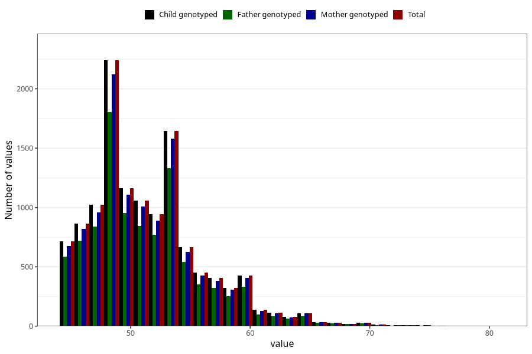

# age_answering_q_45f
Variable mapping to `AGE_YRS_LF` in `MobaForeldre45_Far_v12_standard`.
- Number of values:

| Value | Total | Child genotyped | Mother genotyped | Father genotyped |
| ----- | ----- | --------------- | ---------------- | ---------------- |
| Missing | 68471 | 68471 | 64727 | 43496 |
| Non-missing | 12534 | 12534 | 11890 | 10108 |
| 25th percentile | 48 | 48 | 48 | 48 |
| 50th percentile | 51 | 51 | 51 | 51 |
| 75th percentile | 54 | 54 | 54 | 54 |
| Mean | 51.5406095420456 | 51.5406095420456 | 51.5525651808242 | 51.4616145627226 |
| Standard deviation | 4.75878564674354 | 4.75878564674354 | 4.76193841077785 | 4.71140101667817 |
| N | 12534 | 12534 | 11890 | 10108 |

