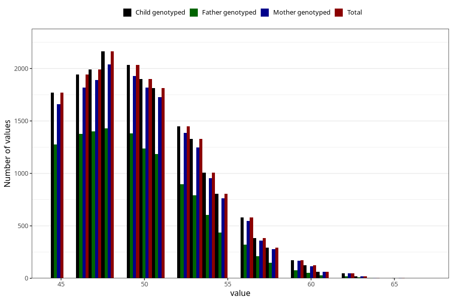

# age_answering_q_45m
Variable mapping to `AGE_YRS_LM` in `MobaForeldre45_Mor_v12_standard`.
- Number of values:

| Value | Total | Child genotyped | Mother genotyped | Father genotyped |
| ----- | ----- | --------------- | ---------------- | ---------------- |
| Missing | 61116 | 61116 | 57776 | 40713 |
| Non-missing | 19889 | 19889 | 18841 | 12891 |
| 25th percentile | 47 | 47 | 47 | 47 |
| 50th percentile | 50 | 50 | 50 | 49 |
| 75th percentile | 52 | 52 | 52 | 52 |
| Mean | 50.0353964502992 | 50.0353964502992 | 50.0490950586487 | 49.6956015824994 |
| Standard deviation | 3.64521116063541 | 3.64521116063541 | 3.64491900567014 | 3.47723997950614 |
| N | 19889 | 19889 | 18841 | 12891 |

