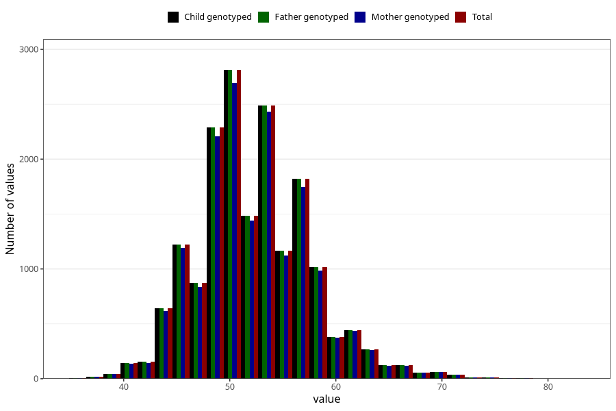

# age_answering_q_hf
Variable mapping to `AGE_YRS_HF` in `HelseFedre`.
- Number of values:

| Value | Total | Child genotyped | Mother genotyped | Father genotyped |
| ----- | ----- | --------------- | ---------------- | ---------------- |
| Missing | 63308 | 63308 | 59511 | 35907 |
| Non-missing | 17697 | 17697 | 17106 | 17697 |
| 25th percentile | 49 | 49 | 49 | 49 |
| 50th percentile | 52 | 52 | 52 | 52 |
| 75th percentile | 55 | 55 | 55 | 55 |
| Mean | 52.2958693563881 | 52.2958693563881 | 52.3186601192564 | 52.2958693563881 |
| Standard deviation | 5.33888222660754 | 5.33888222660754 | 5.34842686244736 | 5.33888222660754 |
| N | 17697 | 17697 | 17106 | 17697 |

