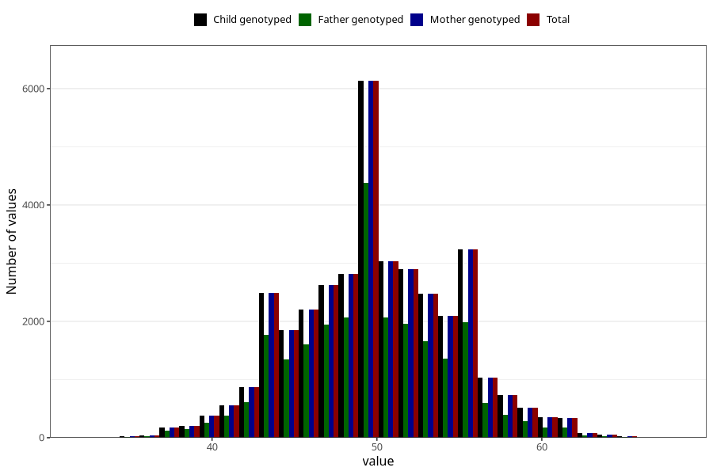

# age_answering_q_hm
Variable mapping to `AGE_YRS_HM` in `HelseModre`.
- Number of values:

| Value | Total | Child genotyped | Mother genotyped | Father genotyped |
| ----- | ----- | --------------- | ---------------- | ---------------- |
| Missing | 43753 | 43753 | 39365 | 28214 |
| Non-missing | 37252 | 37252 | 37252 | 25390 |
| 25th percentile | 47 | 47 | 47 | 47 |
| 50th percentile | 50 | 50 | 50 | 50 |
| 75th percentile | 53 | 53 | 53 | 53 |
| Mean | 49.9433319016429 | 49.9433319016429 | 49.9433319016429 | 49.6248523040567 |
| Standard deviation | 4.76902936391819 | 4.76902936391819 | 4.76902936391819 | 4.58265613548955 |
| N | 37252 | 37252 | 37252 | 25390 |

