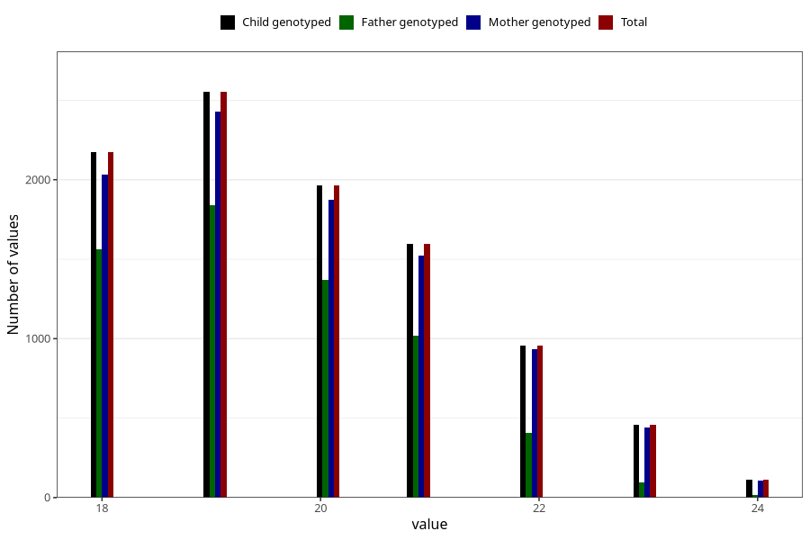

# age_answering_q_ung
Variable mapping to `AGE_YRS_UH` in `UngHelse_standard`.
- Number of values:

| Value | Total | Child genotyped | Mother genotyped | Father genotyped |
| ----- | ----- | --------------- | ---------------- | ---------------- |
| Missing | 71192 | 71192 | 67282 | 47295 |
| Non-missing | 9813 | 9813 | 9335 | 6309 |
| 18 | 2174 | 2174 | 2030 | 1561 |
| 19 | 2552 | 2552 | 2427 | 1839 |
| 20 | 1965 | 1965 | 1874 | 1371 |
| 21 | 1596 | 1596 | 1523 | 1019 |
| 22 | 959 | 959 | 933 | 406 |
| 23 | 457 | 457 | 443 | 95 |
| 24 | 110 | 110 | 105 | 18 |

