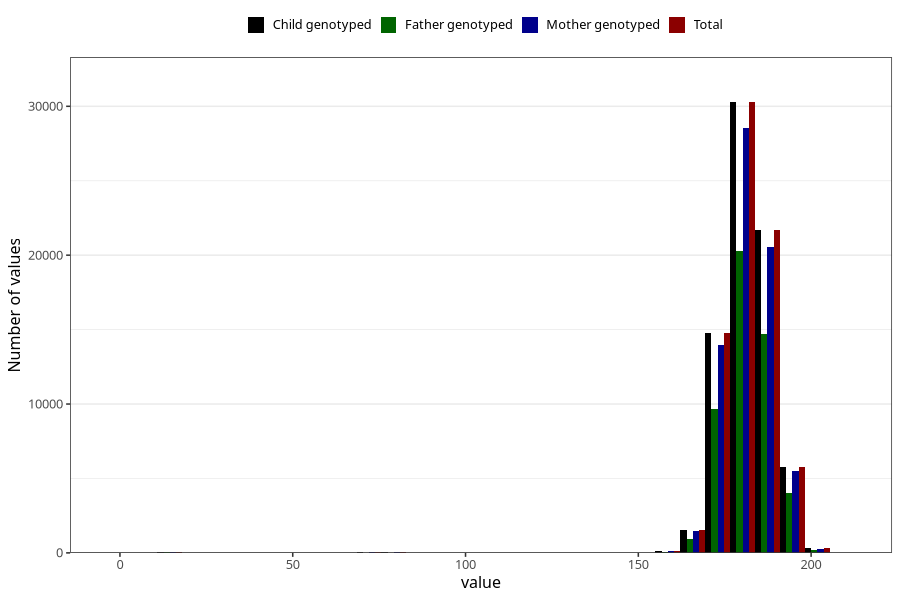

# father_height_15w
Variable mapping to `AA88` in `Skjema1_v12`.
- Number of values:

| Value | Total | Child genotyped | Mother genotyped | Father genotyped |
| ----- | ----- | --------------- | ---------------- | ---------------- |
| Missing | 6317 | 6317 | 5921 | 3563 |
| Non-missing | 74688 | 74688 | 70696 | 50041 |
| 25th percentile | 178 | 178 | 178 | 178 |
| 50th percentile | 181 | 181 | 181 | 182 |
| 75th percentile | 186 | 186 | 186 | 186 |
| Mean | 181.22573907455 | 181.22573907455 | 181.25434253706 | 181.394436562019 |
| Standard deviation | 9.705645435789 | 9.705645435789 | 9.61455157814534 | 9.51320615511393 |
| N | 74688 | 74688 | 70696 | 50041 |

