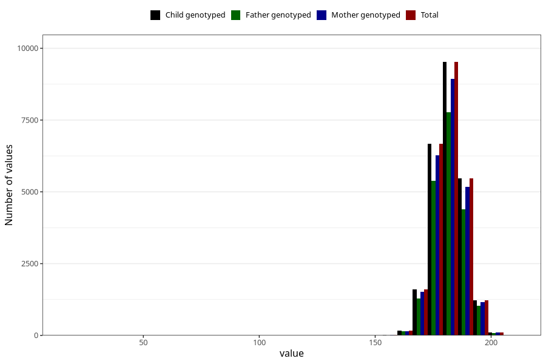

# father_height_self_15w
Variable mapping to `FF333` in `SkjemaFar_v12`.
- Number of values:

| Value | Total | Child genotyped | Mother genotyped | Father genotyped |
| ----- | ----- | --------------- | ---------------- | ---------------- |
| Missing | 56203 | 56203 | 53284 | 33495 |
| Non-missing | 24802 | 24802 | 23333 | 20109 |
| 25th percentile | 178 | 178 | 178 | 178 |
| 50th percentile | 182 | 182 | 182 | 182 |
| 75th percentile | 186 | 186 | 186 | 186 |
| Mean | 181.778485606 | 181.778485606 | 181.792439891998 | 181.822069720026 |
| Standard deviation | 6.76054521251618 | 6.76054521251618 | 6.7723627642906 | 6.72959257498521 |
| N | 24802 | 24802 | 23333 | 20109 |

