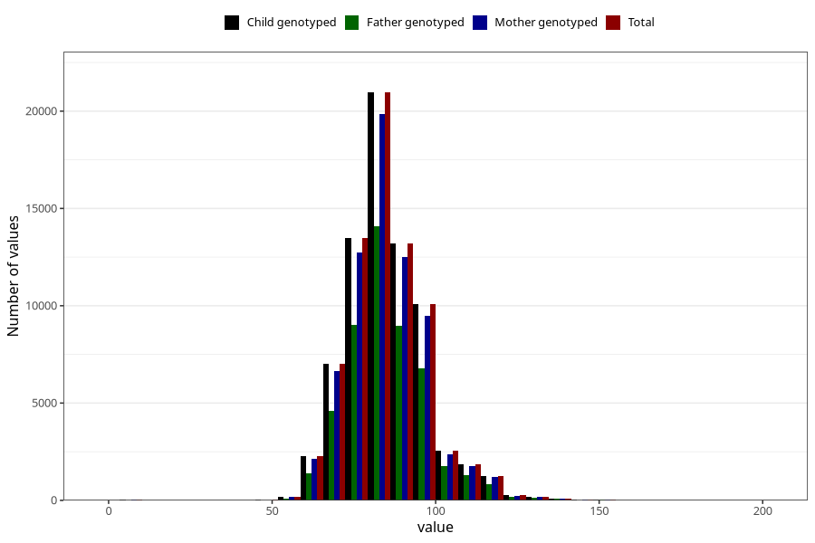

# father_weight_15w
Variable mapping to `AA89` in `Skjema1_v12`.
- Number of values:

| Value | Total | Child genotyped | Mother genotyped | Father genotyped |
| ----- | ----- | --------------- | ---------------- | ---------------- |
| Missing | 7490 | 7490 | 7025 | 4262 |
| Non-missing | 73515 | 73515 | 69592 | 49342 |
| 25th percentile | 77 | 77 | 77 | 77 |
| 50th percentile | 84 | 84 | 84 | 85 |
| 75th percentile | 92 | 92 | 92 | 92 |
| Mean | 85.1784533768619 | 85.1784533768619 | 85.1684389010231 | 85.3781970734871 |
| Standard deviation | 12.3008331796744 | 12.3008331796744 | 12.2860658889588 | 12.2293727517552 |
| N | 73515 | 73515 | 69592 | 49342 |

