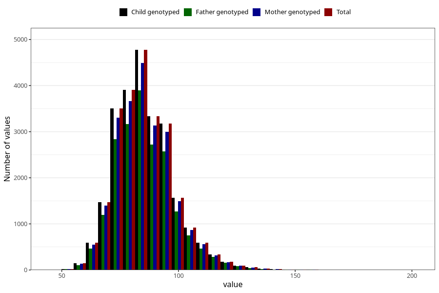

# father_weight_self_15w
Variable mapping to `FF334` in `SkjemaFar_v12`.
- Number of values:

| Value | Total | Child genotyped | Mother genotyped | Father genotyped |
| ----- | ----- | --------------- | ---------------- | ---------------- |
| Missing | 56233 | 56233 | 53310 | 33518 |
| Non-missing | 24772 | 24772 | 23307 | 20086 |
| 25th percentile | 77 | 77 | 77 | 77 |
| 50th percentile | 85 | 85 | 85 | 85 |
| 75th percentile | 93 | 93 | 93 | 93 |
| Mean | 85.7813620216373 | 85.7813620216373 | 85.7621873256961 | 85.8033207209001 |
| Standard deviation | 12.5683142266541 | 12.5683142266541 | 12.4992989860758 | 12.4889875284222 |
| N | 24772 | 24772 | 23307 | 20086 |

