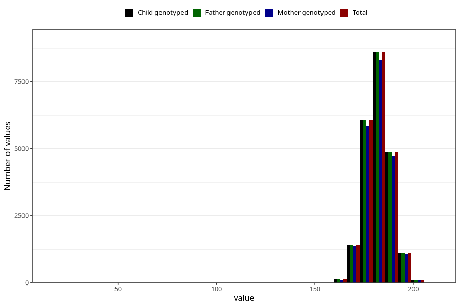

# height_father15
Variable mapping to `G__5` in `Far2_V12`.
- Number of values:

| Value | Total | Child genotyped | Mother genotyped | Father genotyped |
| ----- | ----- | --------------- | ---------------- | ---------------- |
| Missing | 58705 | 58705 | 55061 | 31304 |
| Non-missing | 22300 | 22300 | 21556 | 22300 |
| 25th percentile | 178 | 178 | 178 | 178 |
| 50th percentile | 182 | 182 | 182 | 182 |
| 75th percentile | 186 | 186 | 186 | 186 |
| Mean | 181.809013452915 | 181.809013452915 | 181.818611987382 | 181.809013452915 |
| Standard deviation | 6.77041648054002 | 6.77041648054002 | 6.79024903254264 | 6.77041648054002 |
| N | 22300 | 22300 | 21556 | 22300 |

