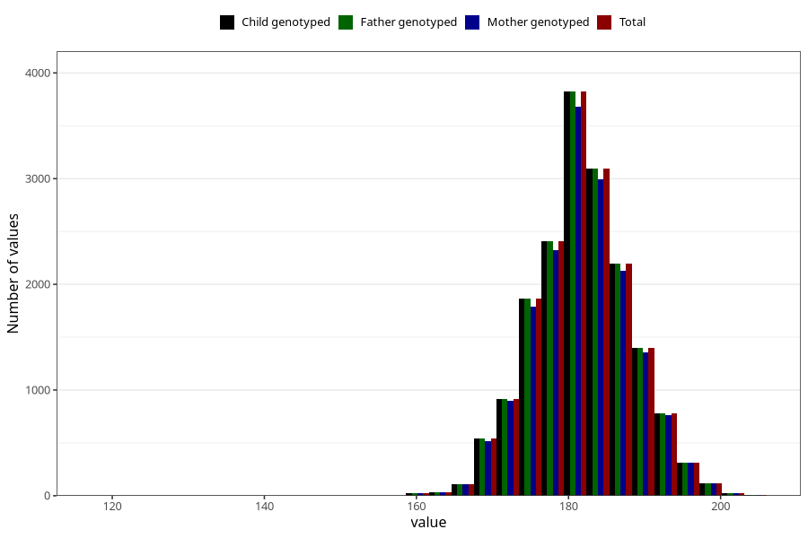

# height_hf
Variable mapping to `HF127` in `HelseFedre`.
- Number of values:

| Value | Total | Child genotyped | Mother genotyped | Father genotyped |
| ----- | ----- | --------------- | ---------------- | ---------------- |
| Missing | 63346 | 63346 | 59549 | 35945 |
| Non-missing | 17659 | 17659 | 17068 | 17659 |
| 25th percentile | 178 | 178 | 178 | 178 |
| 50th percentile | 182 | 182 | 182 | 182 |
| 75th percentile | 186 | 186 | 186 | 186 |
| Mean | 181.851237329407 | 181.851237329407 | 181.864366065151 | 181.851237329407 |
| Standard deviation | 6.36913446640846 | 6.36913446640846 | 6.38599884718086 | 6.36913446640846 |
| N | 17659 | 17659 | 17068 | 17659 |

