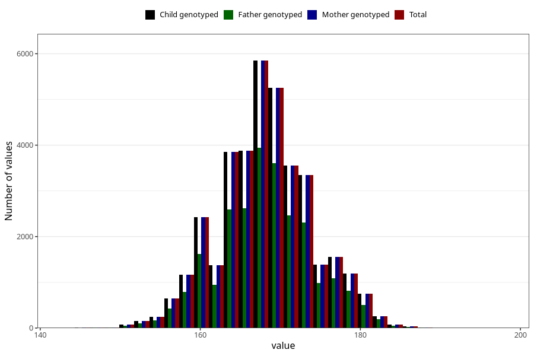

# height_hm
Variable mapping to `HM259` in `HelseModre`.
- Number of values:

| Value | Total | Child genotyped | Mother genotyped | Father genotyped |
| ----- | ----- | --------------- | ---------------- | ---------------- |
| Missing | 43891 | 43891 | 39503 | 28295 |
| Non-missing | 37114 | 37114 | 37114 | 25309 |
| 25th percentile | 164 | 164 | 164 | 164 |
| 50th percentile | 168 | 168 | 168 | 168 |
| 75th percentile | 172 | 172 | 172 | 172 |
| Mean | 168.175998275583 | 168.175998275583 | 168.175998275583 | 168.241297562132 |
| Standard deviation | 5.88417465905001 | 5.88417465905001 | 5.88417465905001 | 5.8838508745379 |
| N | 37114 | 37114 | 37114 | 25309 |

