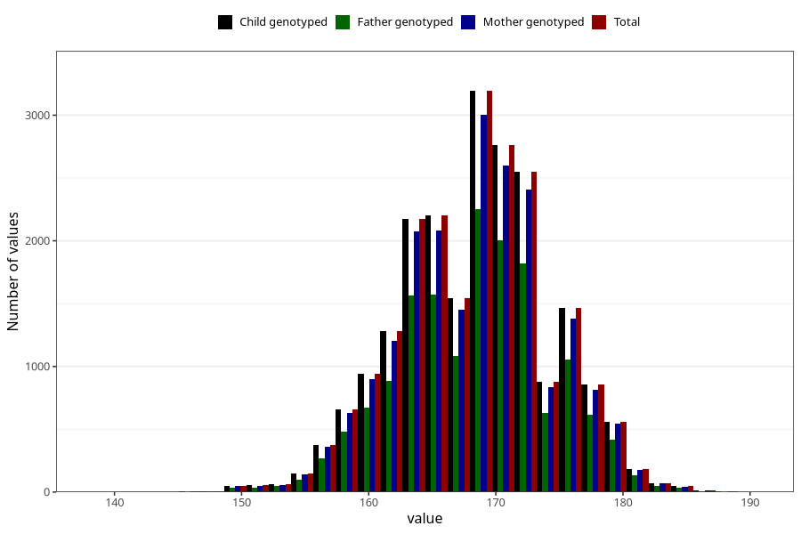

# height_mother_14m
Variable mapping to `UM271` in `Ungdomsskjema_Mor_v12_standard`.
- Number of values:

| Value | Total | Child genotyped | Mother genotyped | Father genotyped |
| ----- | ----- | --------------- | ---------------- | ---------------- |
| Missing | 58922 | 58922 | 55725 | 37854 |
| Non-missing | 22083 | 22083 | 20892 | 15750 |
| 25th percentile | 164 | 164 | 164 | 164 |
| 50th percentile | 168 | 168 | 168 | 168 |
| 75th percentile | 172 | 172 | 172 | 172 |
| Mean | 168.265951184169 | 168.265951184169 | 168.270342714915 | 168.311746031746 |
| Standard deviation | 5.87876440049461 | 5.87876440049461 | 5.89407197570955 | 5.87732727270449 |
| N | 22083 | 22083 | 20892 | 15750 |

